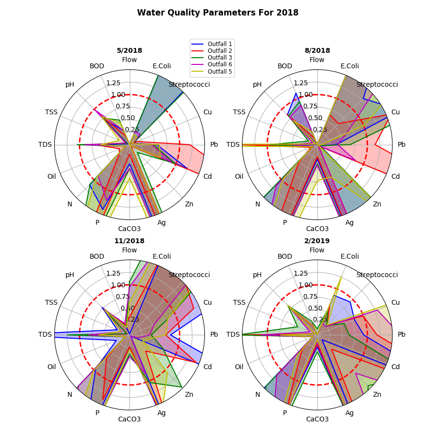

# ARS000002

# Authorization to Discharge Under the National Pollutant Discharge Elimination System and the Arkansas Water and Air Pollution Control Act

## 2018 Annual Report

### 2019-04-01

# Table of Contents

[1.0 Introduction](#1.0-Introduction)

[2.0 Executive Summary](#2.0-Executive-Summary)

[3.0 Municipal Separate Storm Sewer Report](#3.0-Municipal-Separate-Storm-Sewer-Report)

[3.1 Changes to Sormwater Quality Management Program](#3.1-Changes-to-Sormwater-Quality-Management-Program)

[3.2 Revisions to Assessments and Fiscal Analysis](#3.2-Revisions-to-Assessments-and-Fiscal-Analysis)

[3.3 Discharge Monitoring Report Summary](#3.3-Discharge-Monitoring-Report-Summary)

[3.4 MS4 Budget Summary](#3.4-MS4-Budget-Summary)

[3.5 Enforcement, Inspection and Education](#3.5-Enforcement,-Inspection-and-Education)

[3.5.1 ARDOT Enforcement, Inspection and Education](#3.5.1-ARDOT-Enforcement,-Inspection-and-Education)

[3.5.2 Little Rock Enforcement, Inspection and Education](#3.5.2-Little-Rock-Enforcement,-Inspection-and-Education)

[3.6 Changes to Water Quality](#3.6-Changes-to-Water-Quality)

[3.7 Pollution Prevention measures](#3.7-Pollution-Prevention-measures)

[3.7.2 Household Hazardous Waste](#3.7.2-Household-Hazardous-Waste)

[3.8 Structural Controls](#3.8-Structural-Controls)

[3.8.1 ARDOT Drainage Maintenance Report](#3.8.1-ARDOT-Drainage-Maintenance-Report)

[3.8.2 Little Rock Drainage Maintenance Report](#3.8.2-Little-Rock-Drainage-Maintenance-Report)

[3.9 Areas of New Development](#3.9-Areas-of-New-Development)

[3.9.1 ARDOT New Development Summary](#3.9.1-ARDOT-New-Development-Summary)

[3.9.2 Little Rock New Development Summary](#3.9.2-Little-Rock-New-Development-Summary)

[3.10 Roadways](#3.10-Roadways)

[3.10.1 ARDOT Roadway Maintenance](#3.10.1-ARDOT-Roadway-Maintenance)

[3.10.2 Little Rock Roadway Maintenance](#3.10.2-Little-Rock-Roadway-Maintenance)

[3.11 Flood Control Projects](#3.11-Flood-Control-Projects)

[3.11.1 ARDOT Flood Control](#3.11.1-ARDOT-Flood-Control)

[3.11.2 Little Rock Flood Control](#3.11.2-Little-Rock-Flood-Control)

[3.12 Spill Prevention and Response](#3.12-Spill-Prevention-and-Response)

[3.12.1 ARDOT Spill Response Summary](#3.12.1-ARDOT-Spill-Response-Summary)

[3.12.2 Little Rock Spill Response Summary](#3.12.2-Little-Rock-Spill-Response-Summary)

[3.13 Construction Site Runoff](#3.13-Construction-Site-Runoff)

[3.13.1 ARDOT Construction Runoff Reduction](#3.13.1-ARDOT-Construction-Runoff-Reduction)

[3.13.2 Little Rock Construction Runoff Reduction](#3.13.2-Little-Rock-Construction-Runoff-Reduction)

[3.14 Changes to Roles and Responsibility](#3.14-Changes-to-Roles-and-Responsibility)

[3.15 Monitoring and Reporting](#3.15-Monitoring-and-Reporting)

[3.15.1 Representative Monitoring](#3.15.1-Representative-Monitoring)

[3.15.2 Storm Event Data](#3.15.2-Storm-Event-Data)

[3.15.3 Sampling](#3.15.3-Sampling)

[3.15.4 Seasonal Loadings and Event Mean Concentrations](#3.15.4-Seasonal-Loadings-and-Event-Mean-Concentrations)

[3.16 Changes to Legal Authority](#3.16-Changes-to-Legal-Authority)

[3.17 Changes to SWQMP Resources](#3.17-Changes-to-SWQMP-Resources)

[3.18 Changes to SWQMP Review](#3.18-Changes-to-SWQMP-Review)

[4.0 Conclusions](#4.0-Conclusions)

[5.0 Certifications](#5.0-Certifications)

[6.0 Appendices](#6.0-Appendices)

# Appendices

[1997 Annual Report](#1997-Annual-Report)
[Recently Annexed Areas](#Recently-Annexed-Areas)
[Monitoring Data Summary](#Monitoring-Data-Summary)
[Monitoring Data Analysis](#Monitoring-Data-Analysis)
[Key Parameter Trend Analysis](#Key-Parameter-Trend-Analysis)
[Seasonal Trend Analysis](#Seasonal-Trend-Analysis)
[Storm Water Inlet Stencil & Flyer](#Storm-Water-Inlet-Stencil-&-Flyer)
[Disturbed Area](#Disturbed-Area)

# Table of Figures

[Figure 1: Water Quality Parameters for 2018](#Water-Quality-Parameters-for-2018)
[Figure 2: TODO](#TODO)

# Table of Tables

[Table 1: Public Works Street Fund Operating Expenses](#Public-Works-Street-Fund-Operating-Expenses)

[Table 2: Storm Water Ordinance Enforcement Actions](#Storm-Water-Ordinance-Enforcement-Actions)

[Table 3: Recycled Household Hazardous Waste](#Recycled-Household-Hazardous-Waste)

[Table 4: 3-1-1 Maintenance Requests for City of Little Rock MS4](#3-1-1-Maintenance-Requests-for-City-of-Little-Rock-MS4)

[Table 5: Public Works Operations MS4 Maintenance Summary](#Public-Works-Operations-MS4-Maintenance-Summary)

[Table 6: Controls for ARDOT 2017 Projects](#Controls-for-ARDOT-2017-Projects)

[Table 7: Public Education and Outreach Events](#Public-Education-and-Outreach-Events)

[Table 8: Unlawful Discharge Summary](#Unlawful-Discharge-Summary)

[Table 9: ARDOT Construction Site Visits](#ARDOT-Construction-Site-Visits)

[Table 10: Storm Event Data](#Storm-Event-Data)

[Table 11: Outfall Sampling Locations](#Outfall-Sampling-Locations)

[Table 12: E Coli Sampling at MacArthur Park](#E-Coli-Sampling-at-MacArthur-Park)

# 1.0 Introduction
The City of Little Rock (City) and the Arkansas Department of Transportation (ARDOT) are co-permittees under the National Pollutant Discharge Elimination System (NPDES) permit ARS000002 (Permit) in accordance with the Arkansas Water and Air Pollution Control Act and the Clean Water Act. The purpose of the Permit is to outline the activities required for ARDOT and the City of Little Rock to lawfully discharge waters from within the territorial boundaries of the City via the municipal separate storm sewer system (MS4) into the Arkansas River and its tributaries.  Compliance with the terms of the permit is assured by the adoption of storm water quality management plans (SWQMP) which provide guidance on best practices to mitigate the pollution of waterways to the maximum extent practicable (MEP). The Permit became effective 2012-04-01 and is currently administratively effective at the time of this report.

Each section of this report follows the reporting requirements as identified in section 6.9 of the Permit. For clarity, the requirements as given in the permit are shown in quotes, followed by a description of compliance activity associated with the requirement. Where separate reporting by the co-permittees is required, subsections for each permittee are provided.

**Requirement**:
>Annual Report - Each co-permittee shall contribute to the preparation of an annual system-wide report to be submitted by April 1 of each year between the effective date of the permit and the date of expiration. The report shall be in the form as outlined in the SWQMP and shall include the following separate sections, with an overview for the entire MS4 and subsections for the co-permittees where applicable.
Preparation and submittal of a system-wide annual report shall be conducted by the co-permittees. The report shall indicate if the co-permittees have failed to provide required information on the portions of the MS4 for which they are responsible. The co-permittees shall be responsible for timely submittal of the system-wide report. Each co-permittee shall be responsible for content of the report relating to the portions of the MS4 for which it is responsible, and for failure to provide information for the system-wide annual report. Each co-permittee shall sign and certify their portion of the annual report.

# 2.0 Executive Summary
The City and ARDOT have provided policies and ordinances to ensure compliance with the City of Little Rock NPDES permit. The City provides quarterly reports of water quality within various tributaries of the Arkansas River, and these reports do not appear to indicate a trend toward either improvement or deterioration of water quality. ARDOT and the City provide enforcement of policies, inspections, maintenance, monitoring and public education to promote the health of the MS4. These activities include hundreds of miles of storm sewer maintenance, thousands of miles of street maintenance, dozens of public outreach activities and partnerships with volunteers and non-profit organizations. In 2018, these programs cost approximately  $25 million in direct and administrative expenses. Both ARDOT and the City operate under a SWQMP which has provided effective controls for maintaining the quality of surface waters within Little Rock.

# 3.0 Municipal Separate Storm Sewer Report

## 3.1 Changes to Sormwater Quality Management Program
**Requirement:**
>Proposed changes to the stormwater quality management programs that are established as permit conditions, including an update on areas added to the MS4 due to annexation or other legal means

The City of Little Rock and ARDOT propose no changes to the SWQMP for 2018. Approximately 0 acres of land was annexed into the City of Little Rock during 2018. A map of annexations to Little Rock is given in Appendix B.

## 3.2 Revisions to Assessments and Fiscal Analysis
**Requirement:**
>Revisions, if necessary, to the assessments of controls and the fiscal analysis reported in the permit application under 40 CFR 122.26 (d)(2)(v) and 40 CFR 122.26 (d)(2)(vi)

The City of Little Rock and ARDOT propose no revisions to the assessments of controls and fiscal analysis of the permit application.

## 3.3 Discharge Monitoring Report Summary
**Requirement:**
>A summary of the data, including monitoring data that is accumulated throughout the reporting year

Discharge sampling shows a high level of variability between sampling locations and between sampling periods. City staff has not determined any consistent correlation between sampling locations and measured parameters.

Figure 1 presents all reported measurements represented as a percentage of recommended limits for aquatic life as given in the EPA’s Regulation No. 2: Regulation Establishing Water Quality Standards for Surface Waters of the State of Arkansas. Recommended limits for nitrogen and phosphorous are have been derived from the EPA’s ecoregional criteria for Region IX: Southeastern Temperate Forested Plains and Hills. Where specific guidance has is not provided (including hardness, flow, total suspended solids and biological oxygen demand), these factors are represented as a percentage of 95th percentile of all measurements taken from the area since the beginning of the discharge monitoring program.

Figure 1: Normalized measurements of water quality parameters

Additional tables and charts of discharge monitoring are provided in Appendix C.

## 3.4 MS4 Budget Summary
**Requirement:**
>Estimated annual expenditures and projected budget for the year following each annual report.

ARDOT costs to implement the SWMP part of the general operating budget are anticipated to be approximately $900,000 for the upcoming permit year.
City maintenance of the MS4 is paid for by the City Street Fund and is tasked to the 215 employees of the Public Works. In 2018 $8.6 million was budgeted for the maintenance expenses of streets and storm drains, which is expected to become $8.4 million in 2019. Administrative expenses of the Public Works, which includes overhead costs necessary for administration of the NPDES permit, where $4 million in 2018 to $4.9 million in 2019. The City also invests in its storm drainage infrastructure through capital improvement projects financed by sales tax. These improvements are financed in 3-year cycles, with 2018 falling into the 2015-2018 cycle. $2.8 million is spent on each of the seven wards for a total estimated expense of $19.9 million of capital improvements, which include municipal drainage improvements. The City is also the beneficiary of a water quality grant from the Arkansas Natural Resources Commission and the Environmental Protection Agency for the construction of low impact development improvements on Main Street from Markham to Capitol Avenue. $1.4 million is expected to be spent in 2019.

Operations and maintenance costs of the MS4 are met by the City Street Fund. These expenses are summarized in the table below.

### Public Works Street Fund Operating Expenses
| Activity | 2018 | 2019 |
|---|---|---|
| Administration | 984491 | 1997357 |
| Operations Administration | 3093825 | 2906002 |
| Street and Drainage Maintenance | 7579120 | 7388095 |
| Storm Drain Maintenance | 993872 | 1045613 |
| Work Pool | 162984 | 151998 |
| Resource Control and Scheduling | 423782 | 381072 |
| Control Devices | 940121 | 925953 |
| Signals | 1155223 | 1171683 |
| Parking Meters | 110603 | 111634 |
| Civil Engineering | 1808901 | 1804462 |
| Traffic Engineering | 3414186 | 3413682 |
| Parking Enforcement | 302248 | 301607 |
| Total | 20969356 | 21599158 |

Table 1: Operating expenses directly and indirectly related to MS4 maintenance

## 3.5 Enforcement, Inspection and Education
**Requirement:**
>A summary describing the number and nature of enforcement actions, inspections, and public education programs;

## 3.5.1 ARDOT Enforcement, Inspection and Education
ARDOT conducts inspections of its construction projects and maintenance facilities in accordance with existing regulations and ARDOT policy.  Two stormwater related articles were published in the Department’s Arkansas Highways magazine in the May/June Magazine of 2018. The articles published in the Arkansas Highways Magazine are featured on the Stormwater section of the website for easier access. This publication is provided to all Department personnel and the public statewide. Several hundred stormwater education brochures were distributed during environmental education events as well as Arkansas Environmental Education Association events, the Arkansas State Fair, DrainSmArt and other community related activities throughout the year. The Department has added several stormwater-related educational brochures in English and Spanish on its website. The Department has also made stormwater educational material available at six public libraries in the Little Rock area.

## 3.5.2 Little Rock Enforcement, Inspection and Education
Enforcement

The City Public Works is authorized by ordinance to enforce City codes pertaining to stormwater management plans and flood prevention. Through the performance of periodic inspections and complaints, the Public Works took 41 enforcement actions in 2018. The majority of enforcement activity is the issuance of notices of violations by Public Works inspectors for grading permit violations. A summary is given in the table below.

### Storm Water Ordinance Enforcement Actions
| Category | Actions Taken |
|---|---|
| Grading Permit Violations | 31 |
| Unlawful Discharge | 5 |
| Sanitary Sewer Overflows | 3 |
| Stop Work Orders | 2 |
| Total | 41 |

Table 2: Summary of notices and citations issued by the City of Little Rock for stom water code violations

### Inspections

The City Public Works inspects both private and public construction projects for compliance with NPDES requirements. Publicly funded construction projects are inspected at or near a daily basis while private construction projects under Public Works issued permits are inspected periodically as well as following requests, complaints or prior to issuance of certificates of occupancy.

### Education

The City Public Works serves as a repository of information for the Public for topics of water quality and the MS4. Brochures, graphic material and staff are made available to the public Monday through Friday during normal business hours. Supplemental information is provided on the City website. Public outreach pertaining to water quality is disseminated frequently by the City Sustainability Commission and their partner organizations. The City Mayor has made sustainability a priority for the City Public Works department and the public-private partnerships they have facilitated have taken the lead in public education.

The Mayor’s Sustainability Commission was established in 2008 to advise the City on sustainable practices. Since that time, the Commission has worked with various groups in the City to develop new environmentally green policies that have positively impacted city government and the residents of Little Rock.

The City sustainability officer and sustainability educator hosted or are were featured speakers at approximately  outreach events in 2018. These include public speaking events at the following locations:

### Public Education and Outreach Events
| Date | Group | Location | Attendees |
|---|---|---|---|
| 3/6/2018 | Mills High School Scholars Program | MRF and Landfill | 60 students |
| 3/7/2018 | Clinton School Social Enterprise Class | MRF and Landfill | 4 graduate students |
| 3/13/2018 | Lawson Elementary kindergarten class | classroom presentation | 32 student |
| 3/22/2018 | Our House Spring Break Program | MRF and Landfill | 60 students |
| 4/2/2018 | Boy Scout Troop | Holy Souls | 10 kids from 6th grade to seniors in high school |
| 5/14/2018 | Capitol View-Stifft Station N.A. | Oyster Bar | ~30 adults" |
| 7/24/2018 | Ozark Mission Project | Church in Cammack Village | 3 groups of 10-12 kids |
| 7/31/2018 | Ozark Mission Project | Church in Cammack Village | 4 groups of 10-12 kids |
| 8/9/2018 | Woodland Heights Senior Living | living facility by CARTI, 10-11:15 | 10 seniors |
| 10/3/2018 | Pulaski Academy Green Team | PA at lunch time | ~20 people" |
| 11/1/2018 | Pennbrook/Clover Neighborhood Association | LR Funeral Home at 6:30 p.m. | ~20 people" |
| 11/9/2018 | Anthony School | Ohio St. off Mississippii | 5 students, 2 teachers |
| 11/5/2018 | Pulaski Academy entire school | PA at 12:30 | 400 students |
| 11/30/2018 | Lisa High school Env Studies group | MRF and landfill tour | 45 students, two teachers |
| 11/30/2018 | LR Sustainability Commission | landfill tour | 8 commissioners |
| 12/2/2018 | Unitarian Universalist Church | Reservoir location | 10 adults |
| 12/10/2018 | AR Electric Coop | AR Electric Coop off I-30 | 25 employees at ice cream social |
| 1/11/2019 | The Anthony School | school, 10:30-11:15 & 1:30-3:00 | about 35 kids in three different grade levels (3rd, 4th, 5th) |
| 1/15/2019 | The Anthony School | 5th grade class | 20 students |
| 1/17/2019 | The Anthony School | 6th grade class | 20 students |
| 1/24/2019 | LifeQuest Group | 2nd Pres Church | 60 attendees |
| 1/29/2019 | Rockefeller Elementary | school | 3 classes of 20 students |
| 2/12/2019 | The Anthony School | 7th grade class | 20 students |
| 2/19/2019 | Sierra Club | Oyster Bar | 25 attendees |
| 2/20/2019 | The Anthony School | 8th grade class | 15 students |
| 2/21/2019 | The Anthony School | Green Team | 10 students |

Table 7: Public speaking presentations given by the City of Little Rock's recycling and sustainability educator.

Topics included recycling, sustainability, water quality and other topics outlined in the commission’s Roadmap To 2020. Aside from speaking, the sustainability officers also provide promotional content for social media and the City Government Access Channel (LRTV).

Non-government organizations assist the City with meeting its water quality goals directly through cleanups, such as Friends of Fourche Creek (FoFC) and the Keep Little Rock Beautiful (KLRB), as well as promotional and educational activity. FoFC regularly communicates with the public about floatables and othe risks to waterways through Facebook and television and radio interviews. With a small grant from the City of Little Rock Public Works, Audubon Arkansas has produced a children's book with educational material about the importance of our waterways which has been distributed to the following locations:

- Audubon Arkansas – Field trip visitors and Afterschool Programs

- Arkansas State Fair

- Area Elementary Schools

- Centre at University Park

- Central Arkansas Water

- LR Wastewater Reclamation Authority

Audubon Arkansas is also a partner with the local Drain Smart program, where local artists promote awareness of the MS4 with painted murals on curb inlets with high visibility to the public. In 2018 12 murals were commissioned, and another 18 locations are proposed for 2019.

## 3.6 Changes to Water Quality
**Requirement:**
>Identification of water quality improvements or degradation

The City and ARDOT have not identified any changes to water quality in 2018.

## 3.7 Pollution Prevention measures
The City of Little Rock is supported by the Pulaski County Regional Recycling & Waste Reduction District (RRWRD) which facilitates recycling, reuse and the responsible disposal of materials which impact water quality.

Residents are provided with a 65-gallon bin for curbside collection of papers, plastics, glass and metals for recycling. Bins can be requested online or by phone through the City’s 3-1-1 non-emergency service request system. RRWRD also coordinates the operation of Green Stations, which dispose of automotive fluid and fluorescent lighting. The Green Station in Little Rock is located at 10001 Kanis Road which is collocated with the electronic waste recycling drop off.

Approximately $34,170.48 is spent annually to support the Pulaski County RRWRD. Public promotion of these measures is included within annual expenses of both the Sustainability Summit and the Wetlands Maintenance and Sustainability Summit which totaled $64,000 in 2018. Public service announcements are given on LRTV and are included in the annual operating expenses of $300,000 for the LRTV program.

## 3.7.1 Motor Vehicle Fluids
**Requirement:**
>The co-permittees shall ensure the establishment or availability of a program to collect used motor vehicle fluids for recycle or proper disposal. The program will identify locations where used vehicle fluids may be taken for recycling or disposal in accordance with state requirements. The City of Little Rock will publicize materials which can be recycled or disposed, times available to the public for using the facilities, and locations. The annual report shall include the amount of materials collected (weight or volume), the amount of money used for advertising, the method of advertising used to inform the public, and the overall cost of the program.

## 3.7.1.1 ARDOT Motor Vehicle Fluids
ARDOT implemented a program to recycle automotive oil as well as oil from its equipment before March 1, 1997. During the 2018, 1,035 gallons of oil and gas products were recycled from equipment used by crews working in Little Rock.

## 3.7.1.2 Little Rock Motor Vehicle Fluids
 In Little Rock, 7,644 gallons of oil, antifreeze and gasoline were collected by the RRWRD Green Station in 2018. Recycling of motor vehicle fluids is promoted at the sustainability summit and other speaking events by the City sustainability officer as well as on social media and LRTV. The City does not collect itemized costs of advertising for motor vehicle fluid recycling.

### 3.7.2 Household Hazardous Waste
**Requirement:**
>The City of Little Rock shall ensure the establishment or availability of a program to collect household hazardous waste materials for recycle, reuse, or proper disposal. The amount of materials collected (weight or volume), the amount of money used for advertising, the method of advertising used to inform the public, and the overall cost of the program will be included in the annual report.
Recycling of household hazardous waste is promoted at speaking events by the City sustainability officer as well as by content on social media and LRTV. The City does not collect itemized advertising costs for household hazardous waste recycling. The household hazardous waste collected in 2018 by the Little Rock Green Station is shown in table the table below.

### Recycled Household Hazardous Waste
|  |
| 

Table 3: Summary of waste items collected by Little Rock Green Stations

## 3.8 Structural Controls
**Requirement:**
>Structural Controls: Each co-permittee shall operate and maintain any stormwater structural controls over which it has jurisdiction, in a manner so as to reduce the discharge of pollutants to the MEP.

## 3.8.1 ARDOT Drainage Maintenance Report
**Requirement:**
>Arkansas State Highway and Transportation Department will inspect the drainage system for which it is responsible at least once/month. The inspections should include a schedule of maintenance for correcting deficiencies in the system.

ARDOT spent $12,902 to purchase materials to construct or repair catch basins, junction boxes, and ditch paving, and to purchase replacement drainage culverts.  ARDOT spent a total of $107,000 for materials and installation and associated ditch cleaning of minor drainage structures.
ARDOT spent $3,636 to machine clean and reshape existing ditches, remove and properly dispose of 15 CY of excess material.  ARDOT spent $436 to purchase riprap, matting, geotextiles, sod, seed, and fertilizer to repair and prevent ditch and slope erosion.  The total cost of purchase and installation was $4,072.

## 3.8.2 Little Rock Drainage Maintenance Report
**Requirement:**
>The City of Little Rock will inspect 20 percent of the drainage system each year. The drainage system consists of curb and guttering, piping, and open ditches in the City of Little Rock right-of-way and public easements. Areas with recurring drainage problems shall be inspected more frequently. The City of Little Rock will also maintain and clean the ponds along Coleman Creek and within War Memorial Park. These ponds should be inspected twice per year.

*Operations*

The City of Little Rock Public Works Operations provides preventative and complaint-driven maintenance for the MS4. Annual inspections for inadequate drainage are conducted for each of the seven wards as well as periodic inspections of streets and drainage by the street foremen. The 3-1-1 service provides residence with the ability to create and document requests for service and also acts as a scheduling tool for maintenance activity. Over !!TODO!! requests for service were made in 2018 for repairs and maintenance to the MS4.

### 3-1-1 Maintenance Requests for City of Little Rock MS4
| Type of Request | Number of Requests |
|---|---|
| Ditch Maintenance | 1645 |
| Inlet and catch basin cleaning | 873 |
| Inlet and catch basin repair | 87 |

Table 4: Service requests taken online and by phone through the Little Rock 3-1-1 system

The requests for maintenance in the 3-1-1 service only partially address the scope of the maintenance activity provided by the Public Works Operations staff. A complete list of the maintenance operations performed by the Public Works and associated costs is given in the table below.

### Public Works Operations MS4 Maintenance Summary
| Activity | Quantity | Units | Cost |
|---|---|---|---|
| Catch basin repair | 102 | Ea | $126,765 |
| Catch basin cleaning | 918 | Ea | $118,158 |
| Storm Sewer Repair | 922 | LF | $187,661 |
| Emergency Storm Sewer Cleaning | 30 | LF | $823.47 |
| Ditch maintenance, hand cleaning | 614412 | LF | $666,259 |
| Ditch maintenance, Excavation | 20220 | LF | $124,398 |
| Ditch maintenance, Channel construction | 3160 | LF | $39,972 |
| Ditch maintenance, Litter removal | 694377 | LF | $98,960 |
| Ditch maintenance, Mowing | 529 | acres | $54,243 |
| Ditch maintenance, Stabilization (rip-rap) | 426 | sq-yd | $33,383 |
| Street sweeping, Miles swept | 21775 | curb-mi | $649,388 |
| Street sweeping, Litter removed | 1829 | cyd | $25,174 |
| Ditch spraying, minor and major | 10.5 | acres | $3,136.89 |
| Unclassified maintenance activity | 16916 | man-hr | $325,546 |

Table 5: Unit quantities and costs associated directly with the maintenance of the MS4

*Parks and Recreation*

Additionally, many of the open channels and waterways of the MS4 are within municipal parks. The 49 employees of the Parks and Recreation department provide intensive maintainenance, including litter removal and mowing, of the 4,200 acres of developed park land and also monitor and maintain the 1,900 acres of undeveloped parks with the City of Little Rock.

The City Parks and Recreation department provides weekly as well as post-event maintenance of War Memorial Park, which includes the ponds along Coleman Creek. Parks and Recreation has removed sediments and organic matter from the floor of the pond once in 2004 and again in 2009 to preserve fish habitat. The discharge from these ponds is also naturally filtered by the bioswale located downstream of a splash pad within the park. At MacArthur Park, the City Parks and Recreation department has performed monthly sampling of the pond with the assistance of the Arkansas Health Department to measure the efficacy of their campaign to reduce public feeding of geese. The measured quantities of e. coli have reduced over the sampling period, suggesting the campaign is improving water quality within the pond. A summary of results is shown below.

### E Coli Sampling at MacArthur Park
| Quantity | Units |
|---|---|
| 1 | #/ml |

Table 12: The measurements taken at MacArthur Park Pond are not equivalent to the assays taken at the prescribed outfalls. 'Present' indicates that e.coli have been identified by the density of colony-forming-units has not been determined.

Maintenance of the MS4 in public areas is supplemented by volunteer efforts, such as those by the FoFC and KLRB commission. The FoFC conducts over 20 cleanups a year that removes waste such as floatables, tires and even refrigerators from the Fourche Creek Bayou.

## 3.9 Areas of New Development
**Requirement:**
>Areas of New Development: Each co-permittee shall utilize a comprehensive master planning process to develop, implement, and enforce controls which will reduce, to the MEP, the discharge of pollutants from areas of new development and significant redevelopment after construction is completed. The City of Little Rock will require permanent controls, as required by the Little Rock Code of Ordinances, to be implemented at newly developed areas to control the increased volume of water that will be discharged.

The City of Little Rock shall notify construction sites disturbing (clearing, grading, or other construction activities) 1 or more acres within their MS4 boundary of the requirement to contact the Arkansas Department of Environmental Quality (ADEQ), Water Division, about the stormwater regulations and as how to obtain coverage under NPDES Construction Stormwater General Permit (ARR150000) and to develop a Stormwater Pollution Prevention Plan (SWPPP) and to install and maintain erosion and sediment control for the site prior to the start of construction. The City of Little Rock shall also notify sites that are over 5 acres or more within their MS4 boundary of the requirements that they must submit a Notice of Intent (NOI), permit fee and SWPPP to the Arkansas Department of Environmental Quality to obtain coverage under NPDES Construction Stormwater General Permit prior to the start of construction

## 3.9.1 ARDOT New Development Summary
The following projects were under contract in Little Rock at various times during 2018:
- 060395 – Union Pacific RR Overpass (Arch St.) (LR)
- 061275 – Arkansas River Str. & Apprs. (Broadway) (LR/NLR)
- 061277 – Union Pacific RR Str. & Apprs (Roosevelt Rd) (LR)
- 061333 – I-430/Hwy 10 Interchange Impvt. (LR)
- 061390 – Crooked Creek Channel Impvts. (I-30)
- 061437 – I-30 / I-430 Interchange Impvt. (LR) (Phase II)

Quantities and associated costs of erosion control materials are listed in the table below.
### Controls for ARDOT 2017 Projects
| Item | Quantity | Units | Paid Cost |
|---|---|---|---|
| Concrete Ditch Paving | 6,056.20 | Square Yards | $422,126.56 |
| Concrete Riprap | 340.76 | Cubic Yards | $146,424.00 |
| Drop Inlet Silt Fence | 282.00 | Linear Feet | $2,924.68 |
| Erosion Control Matting | 561.33 | Square Yards | $2,245.32 |
| Lime | 21.00 | Tons | $3,412.50 |
| Mulch Cover | 18.15 | Acres | $16,222.39 |
| Rock Ditch Checks | 49.37 | Cubic Yards | $3,608.00 |
| Sand Bag Ditch Checks | 1,482.00 | Bag | $13,893.47 |
| Sediment Removal & Disposal | 133.00 | Cubic Yards | $2,046.00 |
| Seeding | 18.34 | Acres | $19,765.26 |
| Silt Fence | 4,613.00 | Linear Feet | $16,415.43 |
| Solid Sodding | 4,754.39 | Square Yards | $38,325.53 |
| Temporary Seeding | 0.33 | Acres | $233.80 |
| Water | 18.20 | Million Gallons | $96.79 |
| Wattle | 250.00 | Linear Feet | $2,000.00 |
| Total |  |  | $689,739.73 |

Table 6: Payable quantities of erosion controls used in ARDOT highway construction jobs

## 3.9.2 Little Rock New Development Summary
Chapter 29 of City code requires that all construction, subdivision approvals and remodeling activities have a stormwater management and drainage plan approved by the Public Works with the exceptions of residential single family or duplex structures, commercial or industrial structures on lots less than one acre or additions of less than 500 square feet to existing commercial or industrial structures. Permitted stormwater management and drainage plans must conform to the City SWQMP and City Storm Water Management and Drainage Manual.

Review of stormwater management and drainage plans for new construction projects is the responsibility of the City Public Works and includes the evaluation of construction plans for compliance of erosion control, detention and storm sewer design. All construction projects on lots larger than one acre are instructed to contact ADEQ to obtain the necessary permitting. In 2018 Public Works reviewed 117 new construction permits.

## 3.10 Roadways
**Requirement:**
>Roadways: Each co-permittee shall operate and maintain public streets, roads, and highways for which they are responsible in a manner so as to reduce, to the Maximum Extent Practicable (MEP), the discharge of pollutants. The Arkansas State Highway and Transportation Department will sweep all State Highway routes within the City of Little Rock on which curbs and barrier walls are provided once per month. The City of Little Rock will sweep the Central Business District three times a week, one hundred fifty (150) miles of arterial street on which curbs and barrier walls are provided once per week, and the balance of the arterial streets on a monthly basis. Each co-permittee will keep records which will include the number of sweeper units used, amount of debris collected (weight or volume), and problem areas which contribute the highest volume of debris. The annual report shall contain the above information.

## 3.10.1 ARDOT Roadway Maintenance
ARDOT reports the following actions to meet this requirement:
- Spent $700 to purchase material to pickup litter by ARDOT personnel; $342, 428 total cost to pickup litter by ARDOT Personnel and contract; 3,711 CY of litter picked up and disposed of by ARDOT personnel and contract; $0 to purchase materials to pickup litter by jail inmate program.
- Adopt-A-Highway Litter Pickup:  $653 total cost to provide bags, pick up filled bags and dispose of Adopt-A-Highway litter; The Adopt-A-Highway groups did not report the amount of litter they collected.  There are currently 27 Adopt-A-Highway groups in Little Rock who have adopted 37 Miles of highway.
- Street Sweeping: ARDOT spent $205,992 total cost to operate 2 vacuum sweepers in Little Rock which picked up 1,559 CYs of debris during the year.

## 3.10.2 Little Rock Roadway Maintenance
The City of Little Rock services public streets through cleaning, debris removal and repair. Streets are maintained by City employees with assistance provided by volunteers organized by community members, local non-profits and City staff.

- The City of Little Rock supports the Adopt-A-Street program which currently has 212 groups who have adopted 158.25 miles of streets. These volunteer groups do not report quantities of litter removed.
- The City Wide Cleanup, an effort by the Keep Little Rock Beautiful organization is an annual drive to remove litter from the City. In March 2018 821 volunteers collected 60 bags of recyclables and 31 tons of waste. The event covered 418 city blocks, 65 of parks and 3.55 miles of waterways, resulting in the removal of 458 tires from Fourche Creek.
- The Public Works operates nine sweepers which swept 21,780 curb-miles and collected 1,830 cubic yards of litter in 2018 at an estimated cost of $674,600.

## 3.11 Flood Control Projects
**Requirement:**
>Flood Control Projects: Each co-permittee shall ensure any flood control project it undertakes assesses, and minimizes to the MEP, the impacts on water quality of receiving waters. All flood control projects will be reviewed by the City of Little Rock. The annual report shall contain a summary of any flood control projects that were reviewed during the reporting period.

## 3.11.1 ARDOT Flood Control
ARDOT reports no flood control projects for 2018.

## 3.11.2 Little Rock Flood Control
The City of Little Rock reports no flood control projects for 2018.
!!TODO!!

## 3.12 Spill Prevention and Response
**Requirement:**
>Spill Prevention and Response: Each co-permittee shall implement a program to prevent, contain, and respond to spills that may discharge into the MS4. The co-permittees will have supervisory personnel trained for methods of containing spills. The Arkansas Department of Environmental Quality is to be notified immediately after a spill occurs. The criteria for containing and controlling a spill shall be addressed in the Stormwater Quality Management Program. The annual report shall include a summary of any spills and their appropriate responses that occurred within the reporting period.

## 3.12.1 ARDOT Spill Response Summary
ARDOT reports any spills to ADEQ and it participates in the “Keep Arkansas Beautiful” Program. It provides annual training for maintenance personnel in the identification and reporting of illicit discharges into the Department right-of-way.

Members of the Department’s NPDES Section provided annual training, including illicit discharge detection and reporting for District 6 maintenance personnel on February 13, 2019. A make-up training class will be provided on April 24, 2019. The PowerPoint slides used in the training will be posted on the Maintenance Local Area Network for later review by district personnel and a roster of personnel trained will be maintained.

## 3.12.2 Little Rock Spill Response Summary
The City of Little Rock identifies spills by public reporting through 3-1-1 as well as by observations made by City personnel. Spill reports are investigated by the City Public Works, and upon identification of an unlawful discharge into the MS4, ADEQ is provided notification within 24 hours. Following the initial notification, the City conducts enforcement actions and investigation necessary to mitigate the spill. A formal written response is provided to ADEQ Water Quality division within 5 working days of the initial notification. Records of notices of violation and relevant documentation are maintained at the City Public Works. A summary of spill responses is given in the table below.

### Unlawful Discharge Summary
| Date | Location | Type of Discharge | Result |
|---|---|---|---|
| 3/28/2017 | 811 E 6th Street | Carwash | Drain repaired |
| 8/7/2017 | 1400 N Pierce St | Oil | Cleaned, contained |
| 8/14/2017 | 4000 N Rodney Parham | Construction washout | Discharge halted |
| 9/5/2017 | 5901 Sloane Drive | Food waste | Cleaned, contained |
| 9/13/2017 | 106 S Rodney Parham | Food waste | Cleaned, contained |
| 12/8/2017 | 5001 W 65th Street | Sanitary sewage | Pipe repaired, area cleaned |
| 12/15/2017 | 2618 Shackleford | Sanitary sewage | Pipe repaired, area cleaned |
| 12/28/2017 | 3024 Cantrell Road | Sanitary sewage | Pipe repaired, area cleaned |

Table 8: Summary of stormwater ordinances for unlawful discharges during the permit year

## 3.13 Construction Site Runoff
**Requirement:**
>Construction Site Runoff: Each co-permittee shall implement a program to reduce, to the MEP, the discharge of pollutants from construction sites

The annual report will include the number of permits issued, the total permitted acres of disturbed soil, and management practices which were used to achieve compliance with the 5 tons/ per acre per year soil loss tolerance. In addition, AHTD will continue to develop and make available standard details, specifications, and/or manuals identifying acceptable Best Management Practices that must be used on AHTD projects at construction sites which have more than one acre of disturbed soil, and the City of Little Rock will continue to develop and make available standard details, specifications, and/or manuals identifying acceptable Best Management Practices that must be used at construction sites in accordance with the requirements of Chapter 29 of the Little Rock Code of Ordinance.

## 3.13.1 ARDOT Construction Runoff Reduction
**Requirement:**
>SWMP Reporting Requirement:  The Department of Transportation will report annually any revisions to the Standard Specifications for Highway Construction that incorporate new BMPs for construction site runoff and erosion control.

Program Activities:
The ArDOT Standard Specifications were revised and took effect in April 2014. Wattles, Triangular Silt Dikes, and Filter Socks are included in the new Standard Specifications as approved BMPs and are being used on ArDOT construction jobs.  Also, the hydraulically applied erosion control products (HECPs) are being used on ArDOT construction jobs and their effectiveness evaluated on those projects. A Special Provision for Removing and Replacing Topsoil will be incorporated on jobs as project location and size permits.

The Erosion and Sediment Control Design and Construction Manual was updated in December of 2016. ArDOT incorporates erosion control measures into all construction contracts and obtains all necessary permits for work within the Department rights-of-way.  Contractors are required to obtain all necessary permits including ADEQ general storm water permits for any work beyond the rights-of-way such as; borrow pits, stockpile locations, and waste areas. The update includes the newly revised Construction General Permit (ARR150000), Short Term Activity Authorization (STAA) guidance, and updated Best Management Practices. In addition, a Special Provision requiring contractors of ArDOT jobs disturbing an acre or more soil to be certified by the Center for Training Transportation Professionals Training (CTTP) has been implemented for all jobs let after October 1, 2019.
SWMP Reporting Requirement:  The Department of Transportation will report annually the course description and dates of construction site runoff training classes conducted for its personnel within the geographical area covered by the Permit.
Program Activities:
Beginning in February 2010, the Department instituted an erosion and sediment control training and certification course through the University of Arkansas Center for Training Transportation Professionals (CTTP) to train and certify construction and maintenance personnel. The CTTP training is also open to Department contractors.  Additionally, annual NPDES Stormwater training was developed and provided by personnel from the Department’s Environmental Division. In-person training for Maintenance and Construction personnel was conducted on February 13, 2019 and Make-up training will be on April 24, 2019. The PowerPoint slides used in the trainings will be posted on the Maintenance Local Area Network (LAN); and Construction training is provided on the Construction LAN. Training rosters are maintained for all employees who attended or completed annual maintenance or construction training.
SWMP Reporting Requirement: The Department of Transportation will report annually the job numbers, job locations, and dates of site visits.
Program Activities:
Members of the Department’s Environmental Division visited the following area jobs during the Permit year. Job 061102 was visited since there were few active jobs within the city of Little Rock; however the job is within the highly urbanized area.
### ARDOT Construction Site Visits
| Date | Location | Job Number |
|---|---|---|
| 3/2/2017 | Union Pacific RR Overpass (Arch St.)(LR) (S) | 060395 |
| 6/21/2017 | Union Pacific RR Overpass (Arch St.)(LR) (S) | 060395 |
| 9/20/2017 | Union Pacific RR Overpass (Arch St.)(LR) (S) | 060395 |
| 10/3/2017 | Hwy. 67 Interchange (Cabot) | 061102 |
| 1/25/2018 | Hwy. 67 Interchange (Cabot) | 061102 |

Table 9: Dates of inspections by location

## 3.13.2 Little Rock Construction Runoff Reduction
The City’s program for reducing construction site runoff is a combination of monitoring and administrative controls which are written in the SWQMP and codified in Chapter 29 of the City of Little Rock Code of Ordinances. Construction and land alteration activities are subject to permitting by the City, and as a condition of these permits, construction activities must provide plans for erosion control, drainage and NPDES compliance where applicable. Significant land alteration activities are unlawful without a grading permit, except where allowed by Chapter 29 of City code.

In addition to submitting plans for City approval, construction activity is subject to inspection by City staff. Inspections are conducted periodically as well as prior to issuance of certificates of occupancy and any construction or land alteration activity which does not provide adequate erosion controls is subject to stop work orders and other penalties.

In 2018, the City of Little Rock Public Works permitted 117 construction projects, which disturbed a total area of 5100 acres. The result of these land alteration activities is predicted to cumulatively reduce soil loss by 4900 tons/acre/year. A list of all permitted projects is provided in appendix H.

## 3.14 Changes to Roles and Responsibility
**Requirement:**
>An update on Roles and Responsibility if applicable.

ARDOT and the City of Little Rock report no changes to roles and responsibility.

## 3.15 Monitoring and Reporting

## 3.15.1 Representative Monitoring
**Requirement:**
>Representative Monitoring: Monitoring shall be conducted on representative outfalls, internal sampling stations, and/or in-stream monitoring locations to characterize the quality of stormwater discharges from the Municipal Separate Storm Sewer System.

The locations of sampled outfalls are given by the Permit and are believed to be representative of water quality within the MS4. Grab samples of storm water are collected only by qualified personnel and analyzed by ADEQ accredited labs. Quarterly reports are reviewed by City staff authorized in accordance with the Permit.

## 3.15.2 Storm Event Data
**Requirement:**
>Storm Event Data: Quantitative data shall be collected to estimate pollutant loadings and event mean concentrations for each parameter sampled. Records shall be maintained of all analytical results, the date and duration of the storm event sampled: rainfall measurements or estimates of the storm event which generated the sampled runoff; the duration between storm events sampled and the end of the previous measurable storm event; and an estimate of the total volume of the discharge sampled.

All discharge samples were collected during rain events which exceeded 0.1in of precipitation. The measured precipitation in the table below is an average of six ground weather stations within the limits of the City of Little Rock. The time between acquiring samples and the most recent rain event vary from one to six days. Approximately eight liters of water is required for the battery of laboratory tests performed. In total, approximately 160 liters of runoff was sampled during 2018. The City holds records of all reported samples.

### Storm Event Data
| Location | Sample Date | Average Rainfall(in) | Estimated Discharge | Most Recent Rain Event | Time Difference |
|---|---|---|---|---|---|
| outfall 1 | 3/6/2017 | 0.385 | 12.9 Mgal | 3/5/2017 | 1 days |
| outfall 1 | 6/19/2017 | 0.576667 | 0.1 Mgal | 6/13/2017 | 6 days |
| outfall 1 | 10/27/2017 | 0.062 | 17,000 gal | 10/22/2017 | 5 days | ['outfall 1'] | 12/22/2017 | 1 | 4,000 gal | 12/20/2017 | 2 days |
| outfall 2 | 3/6/2017 | 0.385 | 1.6 Mgal | 3/5/2017 | 1 days |
| outfall 2 | 6/19/2017 | 0.576667 | 4,500 gal | 6/13/2017 | 6 days |
| outfall 2 | 10/27/2017 | 0.062 | 6,000 gal | 10/22/2017 | 5 days |
| outfall 2 | 12/22/2017 | 1 | 4,000 gal | 12/20/2017 | 2 days |
| outfall 3 | 3/6/2017 | 0.385 | 0.6 Mgal | 3/5/2017 | 1 days |
| outfall 3 | 6/19/2017 | 0.576667 | 0.2 Mgal | 6/13/2017 | 6 days |
| outfall 3 | 10/27/2017 | 0.062 | 9,590 gal | 10/22/2017 | 5 days |
| outfall 3 | 12/22/2017 | 1 | 1,800 gal | 12/20/2017 | 2 days |
| outfall 5 | 3/6/2017 | 0.385 | 0.6 Mgal | 3/5/2017 | 1 days |
| outfall 5 | 6/19/2017 | 0.576667 | 1,000 gal | 6/13/2017 | 6 days |
| outfall 5 | 10/27/2017 | 0.062 | 5,000 gal | 10/22/2017 | 5 days |
| outfall 5 | 12/22/2017 | 1 | 1,800 gal | 12/20/2017 | 2 days |
| outfall 6 | 3/6/2017 | 0.385 | 3.4 Mgal | 3/5/2017 | 1 days |
| outfall 6 | 7/5/2017 | 0.571667 | 9,500 gal | 7/4/2017 | 1 days |
| outfall 6 | 12/22/2017 | 1 | 4,300 gal | 12/20/2017 | 2 days |

Table 10: Precipitation summaries and discharge estimates for each sampled outfall

## 3.15.3 Sampling
**Requirement:**
>Grab Samples: Grab Samples shall be taken during the first two hours of discharge.

Representative Storm Events: Samples shall be collected from the discharge resulting from a storm event that is greater than 0.1 inches in magnitude and that occurs at least 72 hours from the previously measurable storm event.
Throughout 2018, the City has a contractual agreement with Environmental Services Company, Inc. for the collection, analysis and reporting of storm water samples. Samples are collected quarterly during rain events from five outfall locations as specified in NPDES permit ARS000002.

### Outfall Sampling Locations
| Identifier | Latitude | Longitude |
|---|---|---|
| Outfall 001: | 34° 44' 30" | 92° 20' 30" |
| Outfall 002: | 34° 43' 30" | 92° 21' 30" |
| Outfall 003: | 34° 45' 15" | 92° 26' 00" |
| Outfall 005: | 34° 44' 00" | 92° 14' 30" |
| Outfall 006: | 34° 42' 00" | 92° 15' 36" |

Table 11: Coordinates for outfalls identified for quaterly water quality sampling

Reporting is provided electronically through the Environmental Protection Agency’s NETDMR service.  Electronic reports are certified by an authorized representative of the City.

## 3.15.4 Seasonal Loadings and Event Mean Concentrations
**Requirement:**
>Seasonal Loadings and Event Mean Concentrations: Data shall be maintained to provide estimates for each major outfall of seasonal pollutant loadings and event mean concentrations for a representative storm event for the parameters which the co-permittees must monitor. This information may be estimated from the monitoring results and shall take into consideration land uses and drainage areas for the outfall.

A seasonal trend analysis is given in appendix F.

## 3.16 Changes to Legal Authority
**Requirement:**
>An update on Legal Authority if applicable.

ARDOT and the City of Little Rock report no changes to legal authority.

## 3.17 Changes to SWQMP Resources
**Requirement:**
>An update on SWQMP Resources if applicable.

ARDOT and the City of Little Rock report no changes to SWQMP resources.

## 3.18 Changes to SWQMP Review
**Requirement:**
> Program Modification: The approved SWQMP shall not be modified by the co-permittees without the prior approval of the Director, unless in accordance with the items below:
- Portions of the SWQMP not specifically required by 6.2 may be modified upon written notification to the permitting authority.
- Modifications adding (but not subtracting or replacing) components, controls, or requirements to the approved SWQMP may be made by the co-permittees at any time upon written notification to the permitting authority.
- Modifications made under this paragraph shall not become enforceable permit conditions until such time as the modifications are formally approved.
- Modification requests and notifications shall be signed and shall include a certification that the co-permittees were given an opportunity to comment on proposed changes.

The co-permittees must review and revise the City of Little Rock and Arkansas State Highway and Transportation Department SWQMP to ensure compliance with the requirement to reduce the discharge of pollutants to the Maximum Extent Practicable (MEP) as contained in Section 402(p)(3)(B)(iii) of the Clean Water Act. Specifically, the co-permittees must review and revise the SWQMP sections regarding construction site runoff and public education. The co-permittees shall conduct a review of the current SWQMP and shall revise the SWQMP to include additional BMPs regarding public education and construction site runoff particularly, these revisions will include notification of ADEQ’s NPDES permitting program to construction sites, institute an employee education program, increase public education, increase the frequency of construction site inspections, and notify ADEQ Enforcement Section of construction sites that do not have erosion controls installed. The co-permittees shall submit to ADEQ their suggested revisions to the SWQMP within eleven (11) months following the effective date of the permit.
ARDOT and the City of Little Rock do not propose any changes to the SWQMP at this time.

# 4.0 Conclusions
ARDOT has expended a significant amount of money and personnel resources on such things as personnel training, litter collection, maintenance and repair of the drainage system, and other activities detailed in Section 2.1.  While there is no way to measure the impact of these measures on the quality of surface water within the MS4 area, the Department believes the controls implemented are effective.
The City of Little Rock values the quality of water within its territorial boundaries for the welfare of its residents and the local environment. Through the application of administrative and engineering controls, the resources and manpower spent on maintenance and upkeep of the MS4, and the training of personnel and promotion of public awareness, the City has managed to protect the quality of its waters. Continued application of existing policies and ordinances is expected to maintain the water quality within Little Rock.

# 5.0 Certifications
I certify that the above Annual Report is true and correct to the best of my knowledge.

Samuel Kreimeyer
Civil Engineer I
Cognizant Official
City of Little Rock Public Works

Mark Headley, P.E.
District 6 Engineer
Arkansas Dept. of Transportation

# 6.0 Appendices