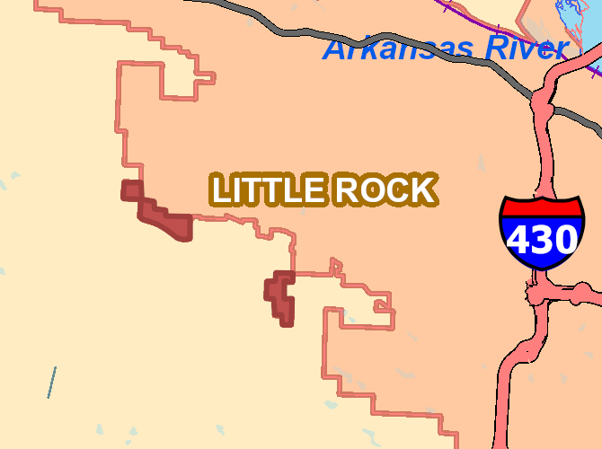

# Appendix C

## Annexations

Annexations into the city of Little Rock can only be approved by a resolution by the board of directors. Newly annexed territories come under the jurisdiction of the City of Little Rock and respectivive water quality ordinances then apply. Land owners who desire to annex land into the City of Little Rock must obtain approval of the Public Works by land alteration permits and review of development proposals. Annexations will increase the size of the MS4 and maintenance responsibility; however, these areas are usually newly developed and have had City staff review of drainage plans. These areas could be reasonably regarded as low-risk to impairment of the MS4 and local water quality.

Annexations for 2018 are given below:

### Annexations
| Number of Territories | Total Acres |
|------|------|
| 2 | 284 |

