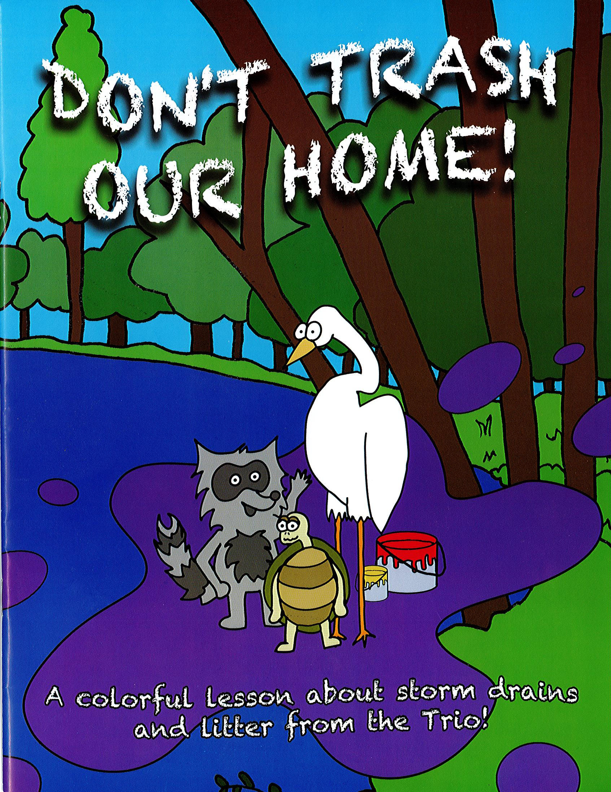
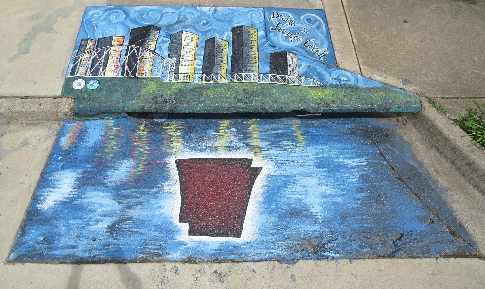
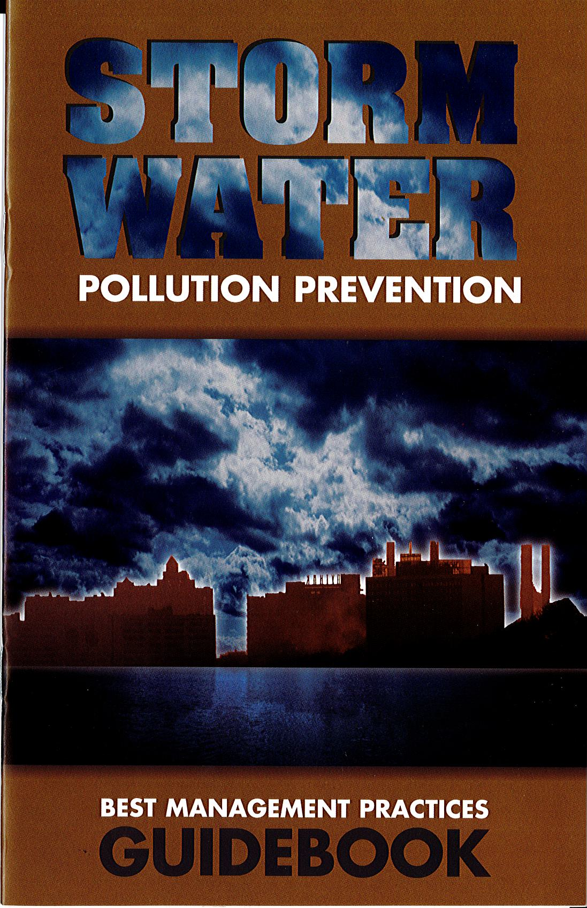
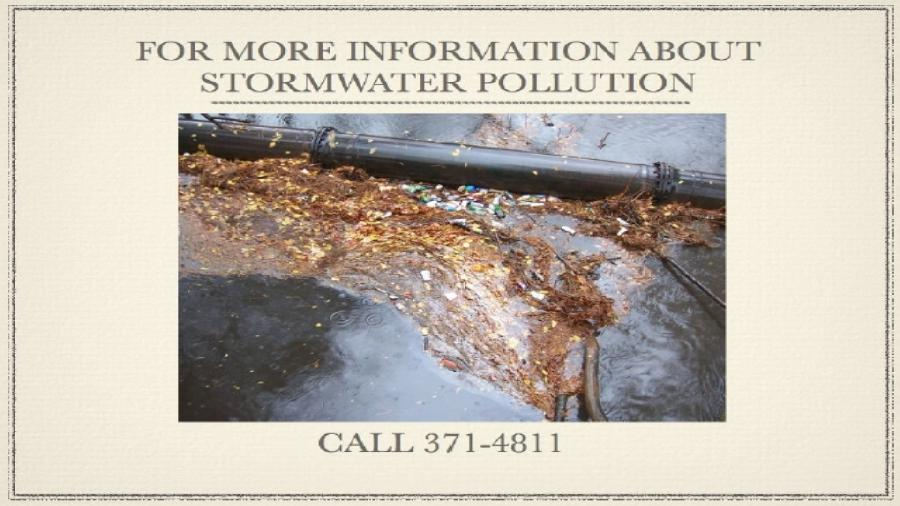
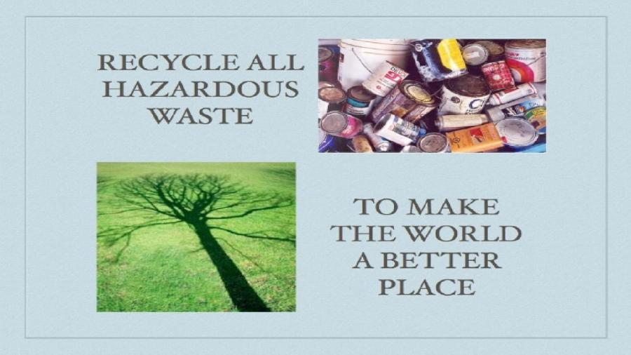
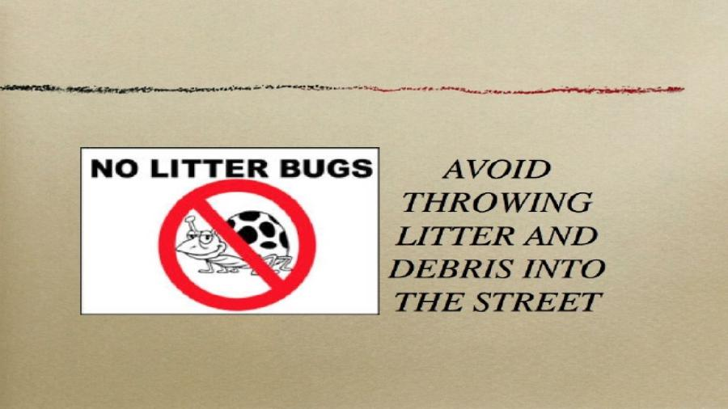

# Appendix D

## Educational and Outreach material

Some examples of the educational material disseminated during the report year are shown below:

### *Don't Trash Our Home* children's activity book

Activity book produced by Audubon Arkansas with a grant from the City of Little Rock Public Works

### Drainsmart Mural

Example of one of the many murals in the Little Rock area meant to educate the public about water quality in a way that beautifies the area and engages local artists (mostly students). Drainsmart is managed by Audubon Arkansas and the City of Little Rock is a sponsor.

### Forests to Faucets Festival

City of Little Rock staff demonstrates a storm drain model to show local 5th graders how littering can affect water quality in their neighborhoods.

### Stormwater Management Guide

The City of Little Rock Public Works makes available educational pamphlets with information about best practices in managing runoff from construction sites. Some soil loss reduction techniques are shown in the Public Works standard details and are required for new construction.

### Super Sammy and Wayne

University of Arkansas Agricultural Extension has made an educational video about water quality and municipal storm sewer systems. This video is shown on LRTV to help promote public awareness about water quality in Little Rock.

### Storm Water Billboard I

Billboard shown at regular intervals on LRTV

### Storm Water Billboard II

Billboard shown at regular intervals on LRTV

### Storm Water Billboard III

Billboard shown at regular intervals on LRTV

### Storm Water Billboard IV

Billboard shown at regular intervals on LRTV

