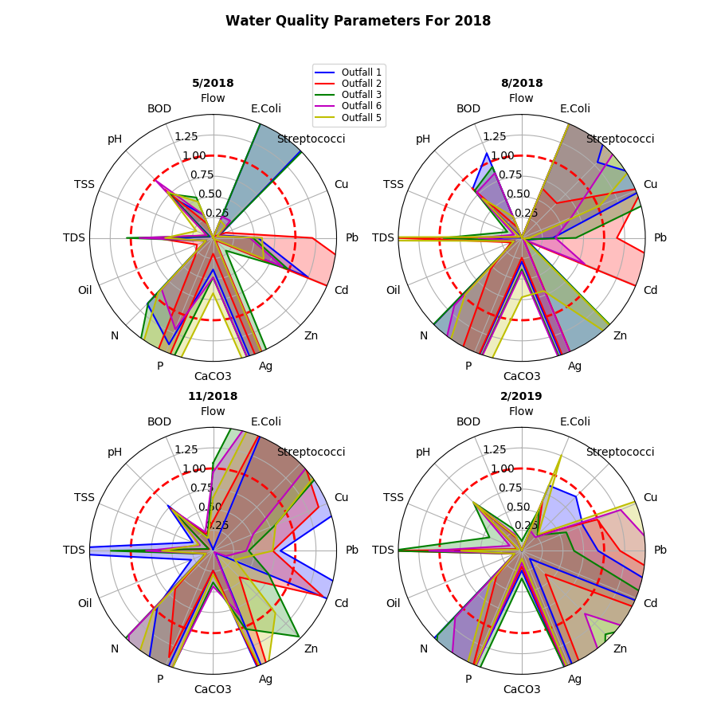
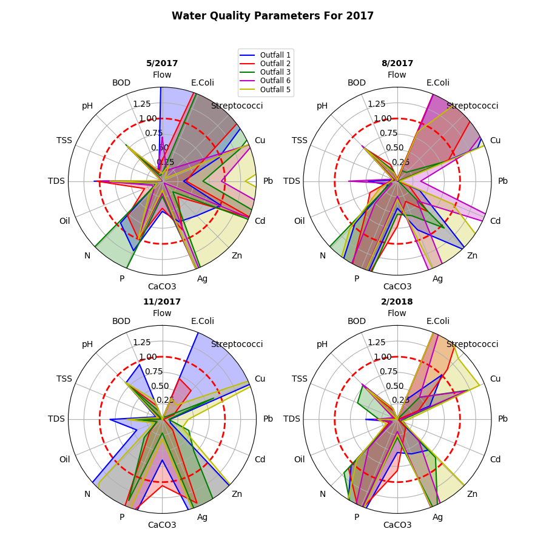
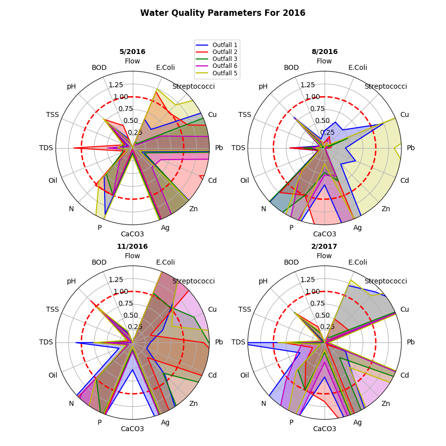
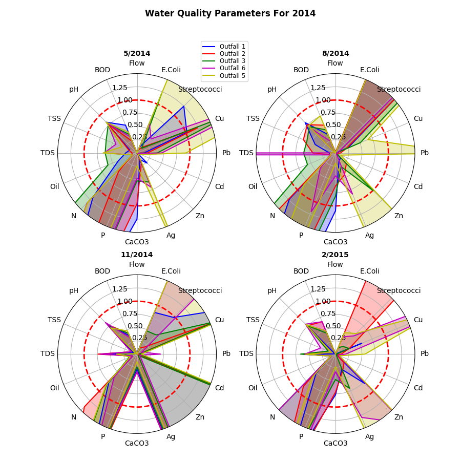
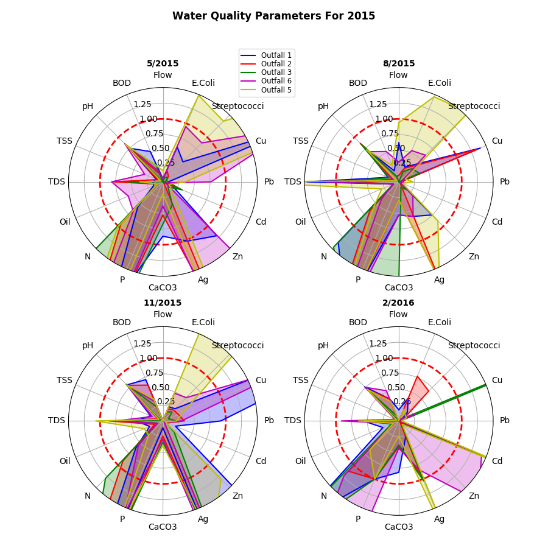

# Appendix E

## Monitoring Summary

Succinctly describing a high-level summary of water quality parameters within the MS4 is a challenging problem for several reasons.

- "High" measurements are dependent upon water hardness, so measures of parameters are not meaningful without context and calculation.
- Parameters do not share the same units of measure.
- Many different parameters are measured, and simple visualizations cannot effectively capture all the required information.
- Measurements are taken from five different locations, each with different characteristics. The problem of a meaningful representation of the mean of these data across the locations does not have a clear solution outside of obvious over-simplification.

In order to deal with these constraints and to avoid distributing the information across a large number of graphs (and losing explanatory power), data for each parameter has been normalized to a scale where 1.0 represents "recommended" limits. Note that the term "limit" is not meant to imply some threshold beyond which environmental hazard is a certainty, but rather the formal guidance for "normal" water quality conditions. All limits (ie 1.0) were determined using formulas given by *Regulation No. 2: Regulation Establishing Water Quality Standards for Surface Waters of the State of Arkansas*. EPA Ecoregional guidance was used where standards are not defined, and where Regulation No. 2 and EPA Ecoregional guidelines are absent, the 95th percentile of all measures was used. The source code for determining these limits is shown below.

```
def gen_limits(self, hardness):
    """ Acceptable limits of metals are hardness specific. Create a dictionary of
    upper limits based on AR WQS guidance
    """
    limits = {}
    # Overwrite with hard values where applicable
    limits["pH"] = 9  # Min is 6. Not an obvious way to make this happen
    limits["N"] = 0.69  # EPA Ecoregional
    limits["P"] = 0.05  # EPA Ecoregional
    limits["Cr"] = np.e ** (0.819 * np.log(hardness) + 3.688) * 0.316
    limits["Cu"] = np.e ** (0.9422 * np.log(hardness) - 1.464) * 0.960
    limits["Pb"] = np.e ** (1.273 * np.log(hardness) - 1.460) * (
        1.46203 - np.log(hardness) * 0.145712
    )
    limits["Hg"] = 2.4 * 0.85
    limits["Ni"] = np.e ** (0.8460 * np.log(hardness) + 3.3612) * 0.998
    limits["Se"] = 20
    limits["Ag"] = np.e ** (1.72 * np.log(hardness) - 6.52) * 0.85
    limits["Zn"] = np.e ** (0.8473 * np.log(hardness) + 0.8604) * 0.978
    limits["Cd"] = np.e ** (1.28 * np.log(hardness) - 3.828) * (
        1.36672 - np.log(hardness) * 0.041838
    )
    limits["E.Coli"] = 410
    limits["Streptococci"] = 400
    limits["Cyanide"] = 22.36
    limits["TDS"] = 103  # This is reference only. Little Fource: 179mg/L
    limits["Oil"] = 15
    return limits
```

Normalizing these parameters which use a variety of different scales allows us to quickly visualize which parameters are "high" or "low" relative to regional norms. The large number of parameters and multiple locations lends itself to either a very 'busy' bar graphs or splitting the visualization over multiple graphs. Desiring a 'snapshot' of MS4 water quality, a radar chart with normalized data was selected as the most expressive visualization for this multifaceted problem. Charts for the previous five years are given below.
















