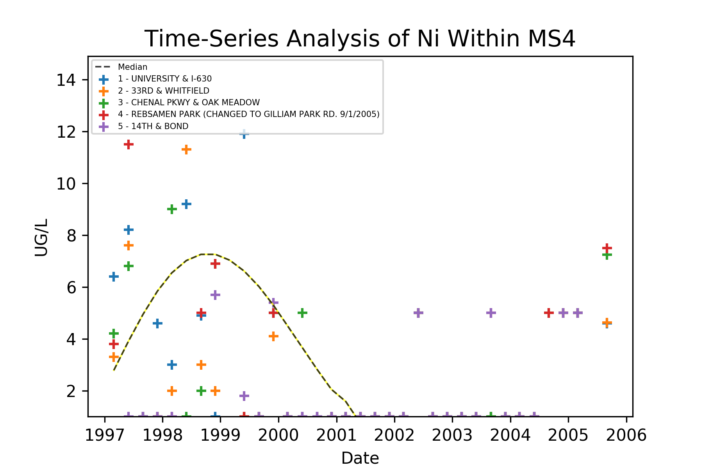

# Appendix F

## Water Quality Trend Analysis

This section contains scatter plots for each measured parameter for the entire life of the monitoring program (1997 to the present). Each point is color-coded based on location to help visualize regional dissimilarities in measurements. The distribution of measurements for water quality parameters within the City of Little Rock MS4 tends to be heavily skewed with maximums definied by fliers one or more orders of magnitude above the mean, in most cases. Because the measurements tend to appear erratic when plotted, a 'median' line is given to assist with visualizing a general trend. Wide variability makes direct plotting of the median difficult to reason about, so a noise-filtering algorithm (savoy-golay filtering) is used to smooth the graph into something intelligible.

