# Appendix G

## Seasonal Analysis

The following graphs show the distribution grouped by season of all measurements (1997 to the present) for the entitled parameter.

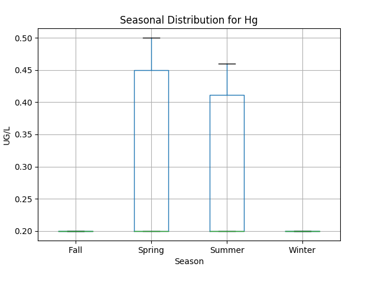

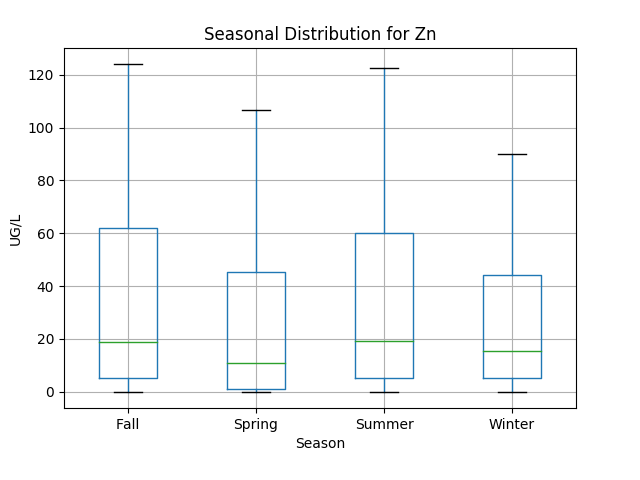

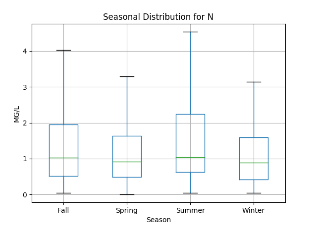

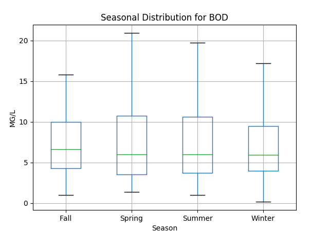

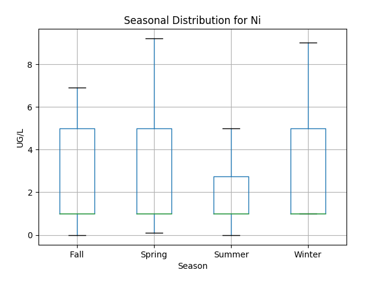

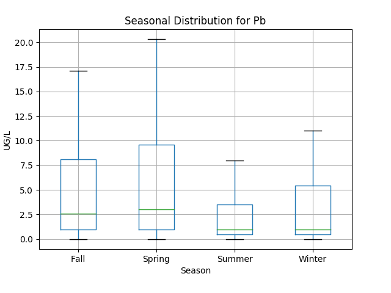

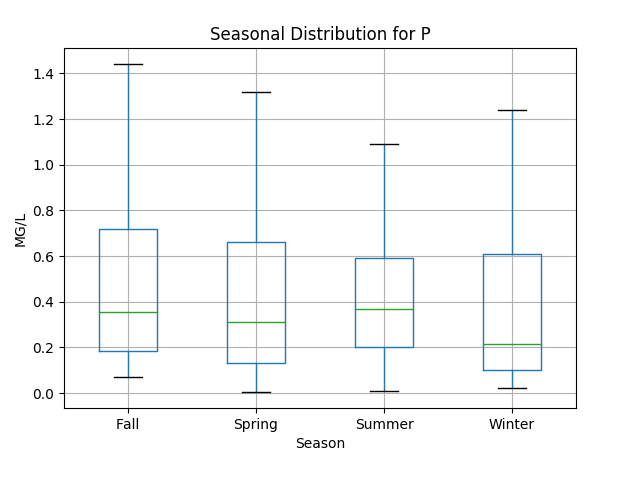

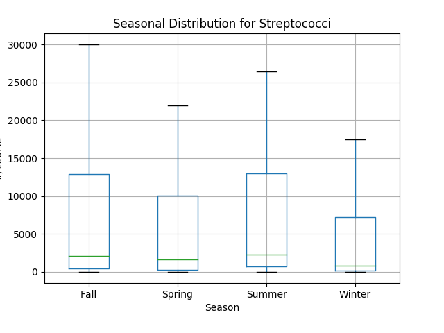

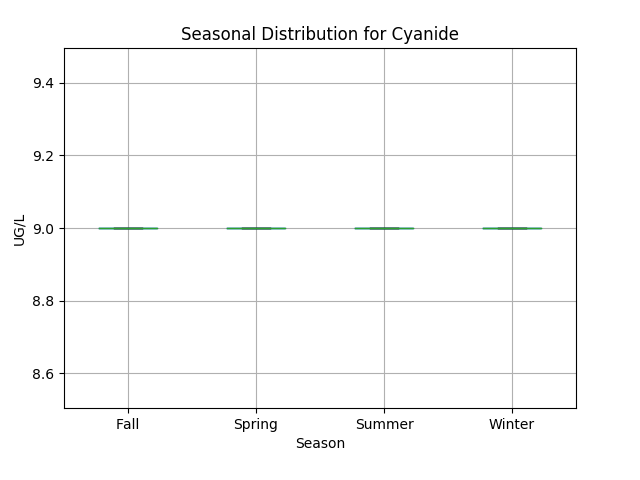

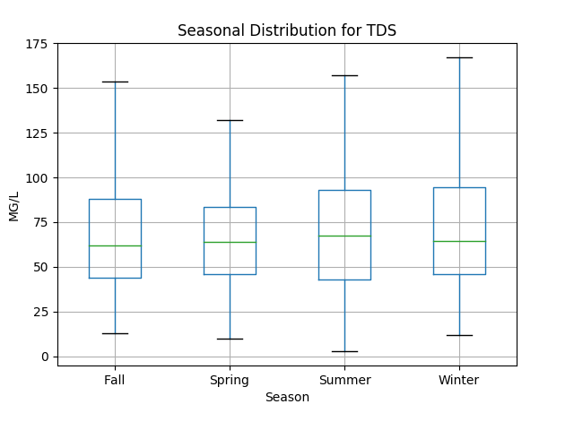

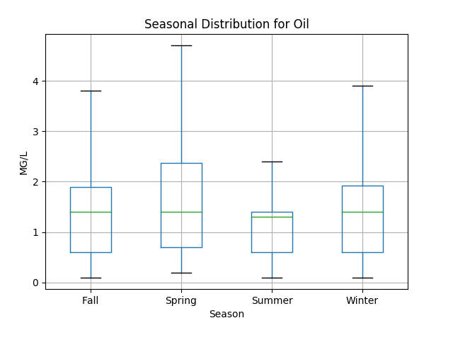

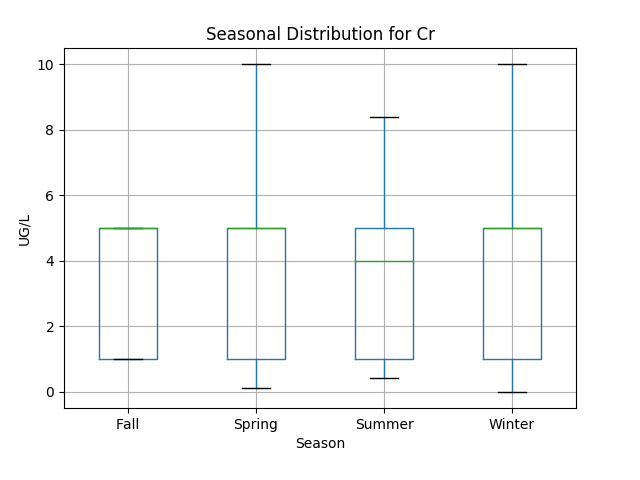

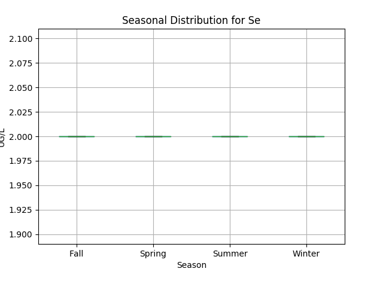

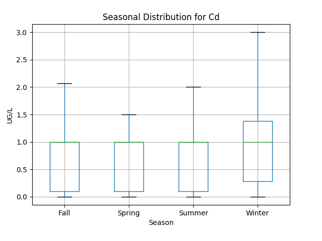

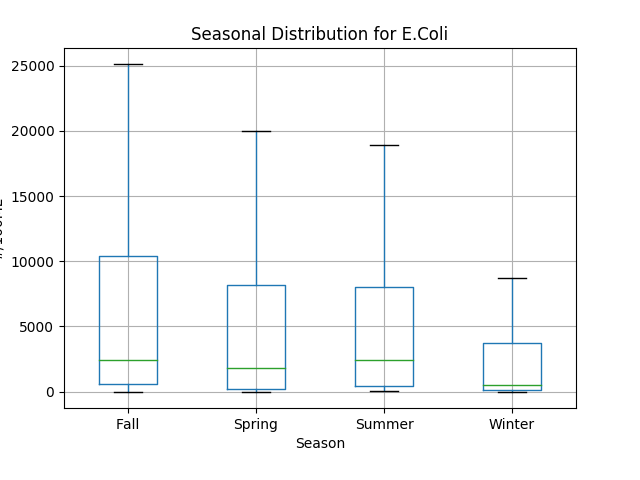

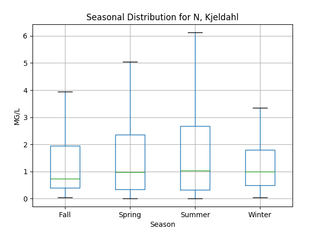

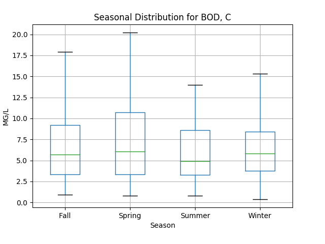

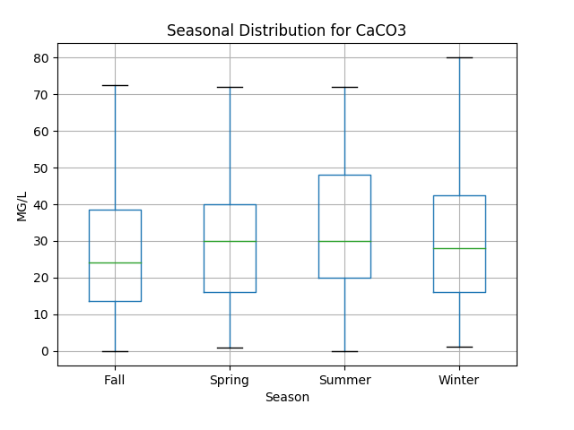

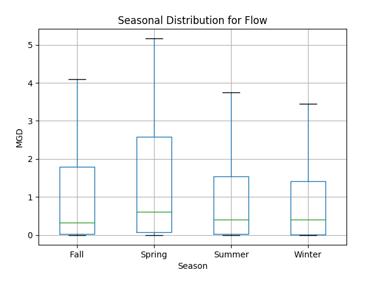

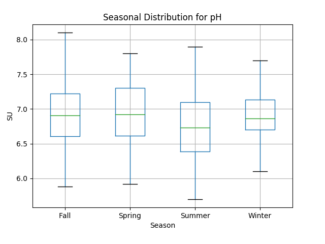

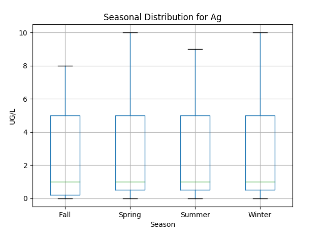

