# Appendix H

## Regional Analysis

The following graphs show the distribution grouped by location of all measurements (1997 to the present) for the entitled parameter.

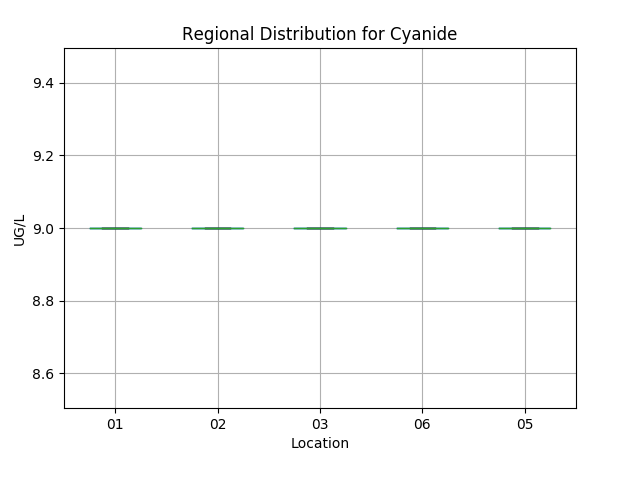

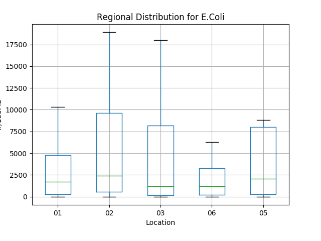

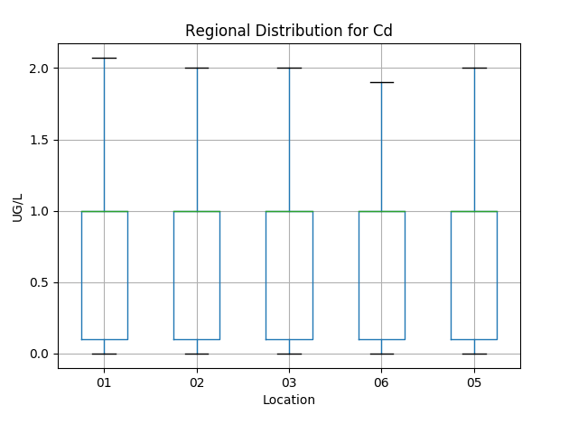

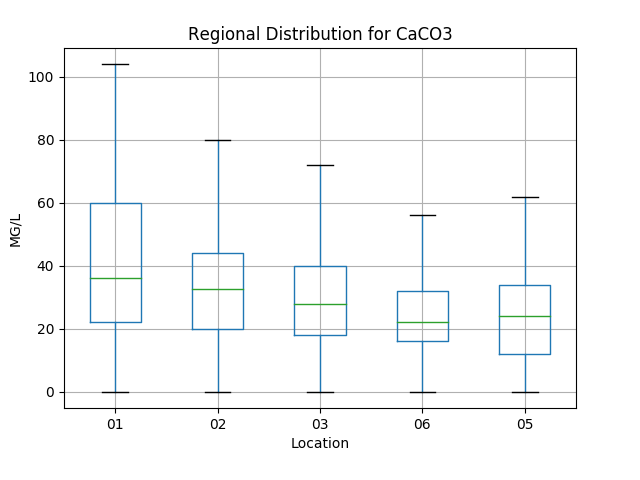

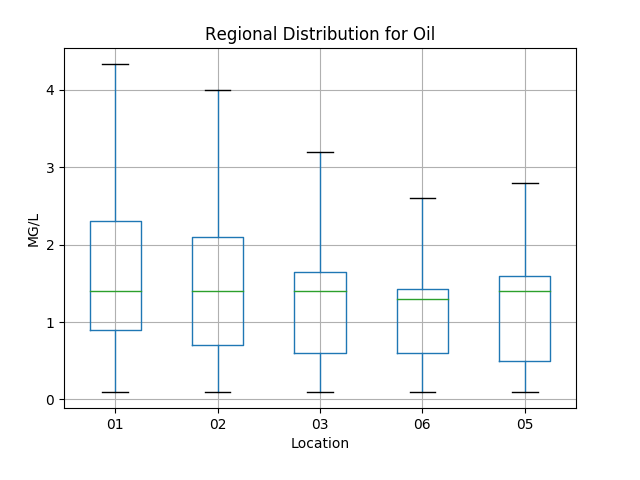

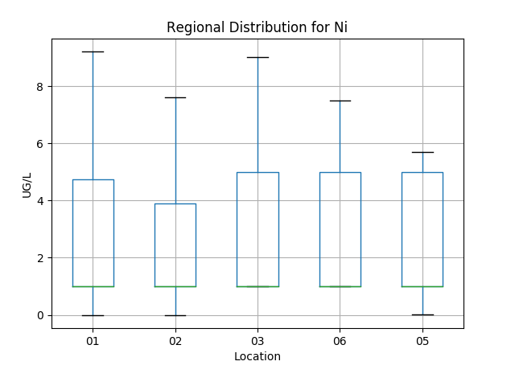

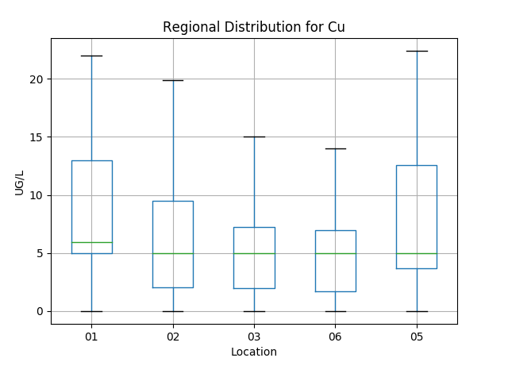

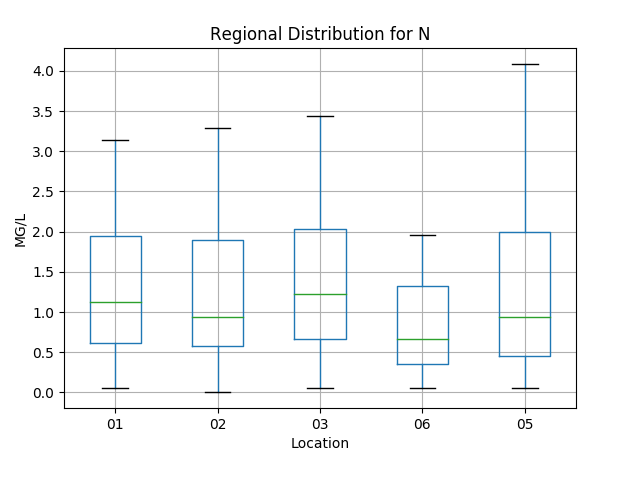

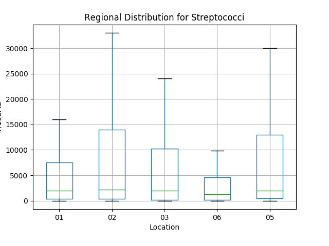

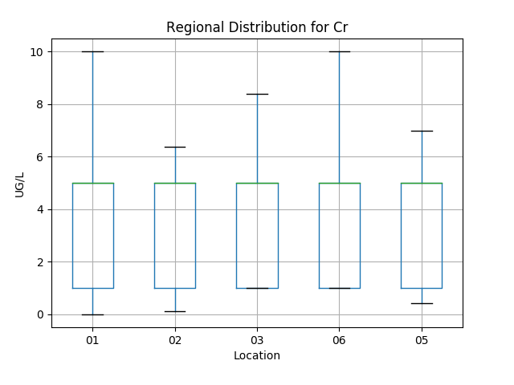

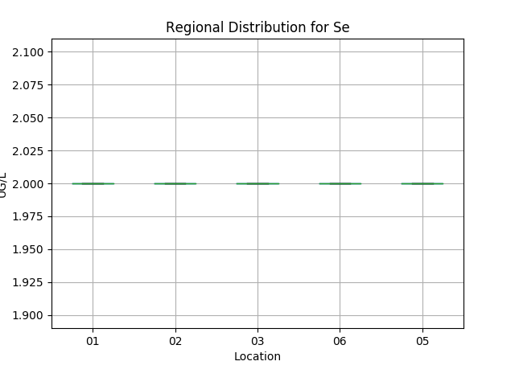

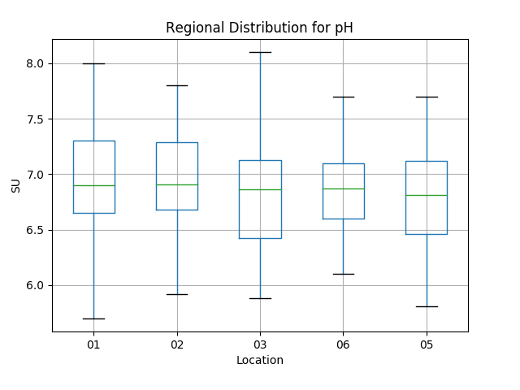

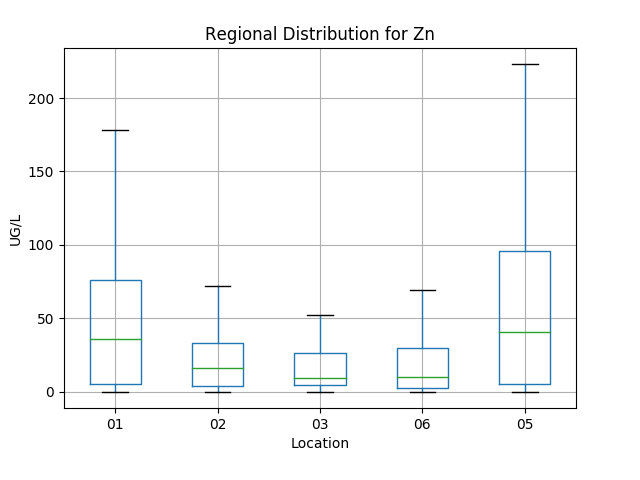

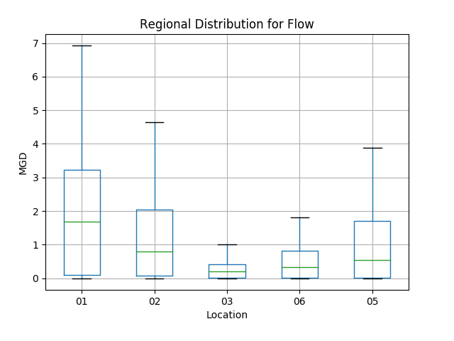

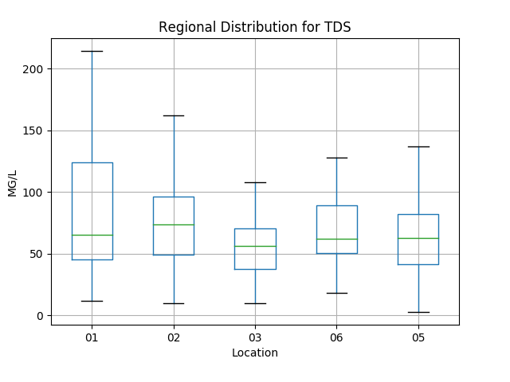

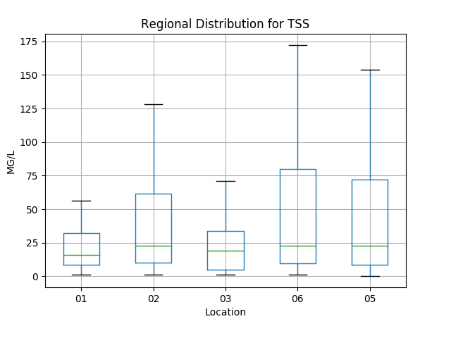

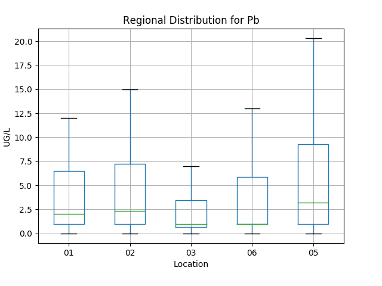

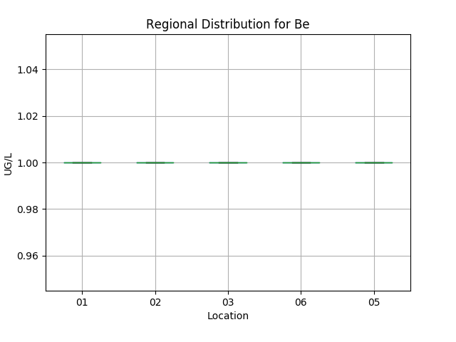

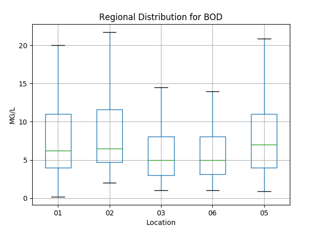

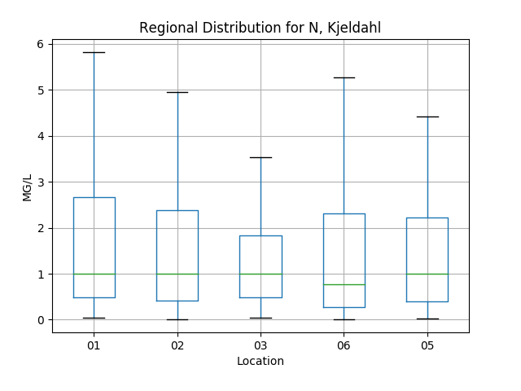

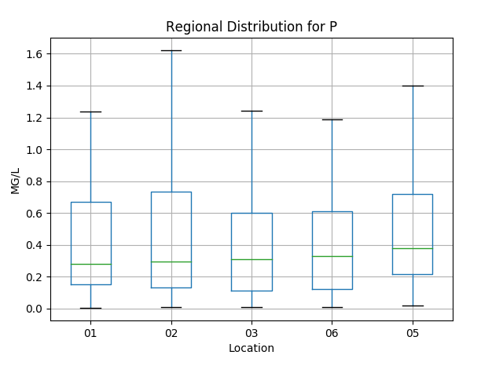

